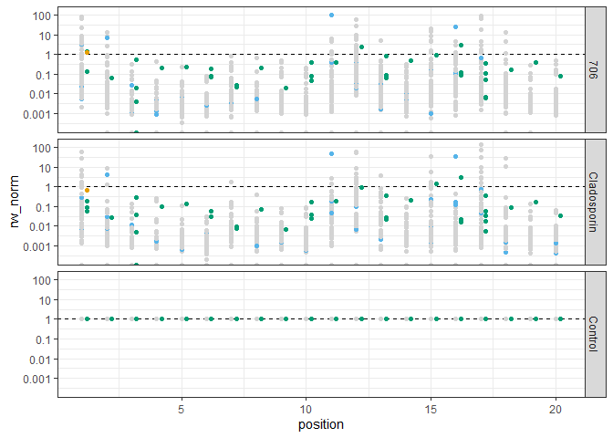
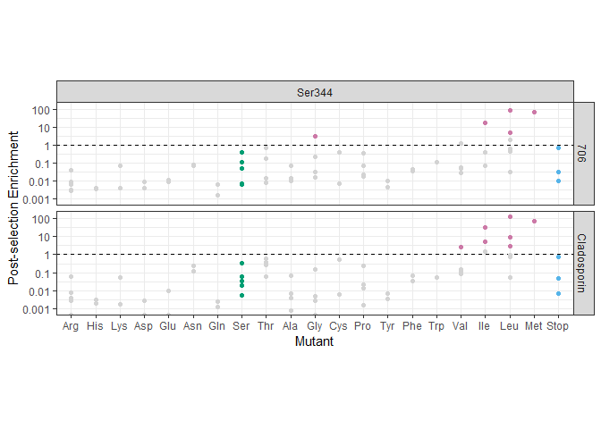

03_mutlib-normalisation
================
Stuart MacGowan
2024-02-10

This notebook identifies putative resistance alleles from deep
mutagenesis screening.

## Normalisation

This scheme normalises by total library size and relative to the
pre-selection library, in accord with RW’s design.

``` r
# dedupe mutlib on sequence
mutlib |>
  group_by(condition) |>
  distinct(Sequence, .keep_all = TRUE) ->
  mutlib

# filter postions 0 and 21
mutlib |>
  filter(position != 0, position != 21) ->
  mutlib


# Step 1: Library proportions
mutlib |>
  # filter(!is_wildtype) |>
  filter(position != 0 & position != 21) |>
  group_by(condition) |>
  # use norm_control already calculated
  mutate(lib_prop = Count / sum(Count)) ->
  mutlib

# Step 2: Normalise treatments (datasets 2 and 3) to wildtype (dataset 1)
mutlib |>
  # filter(!is_wildtype) |>
  filter(position != 0 & position != 21) |>
  group_by(position, codon) |>
  # use norm_control already calculated
  mutate(rw_norm = lib_prop / lib_prop[dataset == 1]) ->
  mutlib

mutlib |>
  arrange(desc(rw_norm)) |>
  head(10)
```

    ## # A tibble: 10 × 17
    ## # Groups:   position, codon [6]
    ##    dataset Name     Sequence      Count codon amino_acid position wildtype_codon
    ##      <dbl> <chr>    <chr>         <dbl> <chr> <chr>         <dbl> <chr>         
    ##  1       2 KRS17TTA TATGAAATTGG… 618384 TTA   Leu              17 TCG           
    ##  2       3 KRS11TAG TATGAAATTGG… 253023 TAG   Stop             11 CAT           
    ##  3       3 KRS17TTA TATGAAATTGG… 499418 TTA   Leu              17 TCG           
    ##  4       3 KRS1TCG  TATGAAATTGG… 186445 TCG   Ser               1 GTA           
    ##  5       2 KRS17ATG TATGAAATTGG… 190547 ATG   Met              17 TCG           
    ##  6       3 KRS17ATG TATGAAATTGG… 225904 ATG   Met              17 TCG           
    ##  7       3 KRS1GGT  TATGAAATTGG… 119024 GGT   Gly               1 GTA           
    ##  8       2 KRS12GAA TATGAAATTGG… 170585 GAA   Glu              12 AAT           
    ##  9       2 KRS1TCG  TATGAAATTGG… 103492 TCG   Ser               1 GTA           
    ## 10       3 KRS12GAA TATGAAATTGG… 202954 GAA   Glu              12 AAT           
    ## # ℹ 9 more variables: is_wildtype <lgl>, wildtype_residue <chr>,
    ## #   is_wildtype_residue <lgl>, condition <chr>, mutation_type <chr>,
    ## #   residue <chr>, mutation <chr>, lib_prop <dbl>, rw_norm <dbl>

``` r
mutlib |>
  mutate(position = position + -0.4 * (-0.5 * is_wildtype_residue)) |>  # dodge
  ggplot(aes(x = position, y = rw_norm, colour = mutation_type)) +
  facet_grid(condition ~ .) +
  geom_hline(yintercept = 1, linetype = "dashed") +
  geom_point() +
  # scale_y_log10 with nice log ticks
  scale_y_log10(breaks = c(0.001, 0.01, 0.1, 1, 10, 100, 1000),
                labels = c("0.001", "0.01", "0.1", "1", "10", "100", "1000")) +
  scale_colour_manual(values = mutation_type_colours) +
  guides(colour = FALSE) +
  theme_bw()
```

    ## Warning: The `<scale>` argument of `guides()` cannot be `FALSE`. Use "none" instead as
    ## of ggplot2 3.3.4.
    ## This warning is displayed once every 8 hours.
    ## Call `lifecycle::last_lifecycle_warnings()` to see where this warning was
    ## generated.

    ## Warning: Transformation introduced infinite values in continuous y-axis

<!-- -->

``` r
# Key sites
mutlib |>
  # filter(residue %in% c("Val328", "Asn339", "Phe342", "Ser344")) |>
  filter(residue %in% c("Ser344")) |>
  filter(condition != "Control") |>
  mutate(amino_acid = factor(amino_acid, levels = c("Arg", "His", "Lys", "Asp", "Glu", "Asn", "Gln", "Ser", "Thr", "Ala", "Gly", "Cys", "Pro", "Tyr", "Phe", "Trp", "Val", "Ile", "Leu", "Met", "Stop"))) |>
  mutate(position = position + -0.4 * (-0.5 * is_wildtype_residue)) ->  # dodge
  plot_data
plot_data
```

    ## # A tibble: 126 × 17
    ## # Groups:   position, codon [63]
    ##    dataset Name     Sequence      Count codon amino_acid position wildtype_codon
    ##      <dbl> <chr>    <chr>         <dbl> <chr> <fct>         <dbl> <chr>         
    ##  1       2 KRS17TTT TATGAAATTGG…    268 TTT   Phe              17 TCG           
    ##  2       2 KRS17TTC TATGAAATTGG…     86 TTC   Phe              17 TCG           
    ##  3       2 KRS17TTA TATGAAATTGG… 618384 TTA   Leu              17 TCG           
    ##  4       2 KRS17TTG TATGAAATTGG…   1918 TTG   Leu              17 TCG           
    ##  5       2 KRS17CTT TATGAAATTGG…   6384 CTT   Leu              17 TCG           
    ##  6       2 KRS17CTC TATGAAATTGG…     54 CTC   Leu              17 TCG           
    ##  7       2 KRS17CTA TATGAAATTGG…  18608 CTA   Leu              17 TCG           
    ##  8       2 KRS17CTG TATGAAATTGG…   1021 CTG   Leu              17 TCG           
    ##  9       2 KRS17ATT TATGAAATTGG…  77914 ATT   Ile              17 TCG           
    ## 10       2 KRS17ATC TATGAAATTGG…  62527 ATC   Ile              17 TCG           
    ## # ℹ 116 more rows
    ## # ℹ 9 more variables: is_wildtype <lgl>, wildtype_residue <chr>,
    ## #   is_wildtype_residue <lgl>, condition <chr>, mutation_type <chr>,
    ## #   residue <chr>, mutation <chr>, lib_prop <dbl>, rw_norm <dbl>

``` r
plot_data |>
  ggplot(aes(x = amino_acid, y = rw_norm, colour = mutation_type)) +
  facet_grid(condition ~ residue) +
  geom_hline(yintercept = 1, linetype = "dashed") +
  geom_point() +
  # overplot > 2 mutations pink
  geom_point(data = mutlib |> filter(residue == "Ser344" & mutation_type == "Mutant" & rw_norm > 2),
             colour = "#CC79A7") +
  # scale_y_log10 with nice log ticks
  scale_y_log10(breaks = c(0.001, 0.01, 0.1, 1, 10, 100, 1000),
                labels = c("0.001", "0.01", "0.1", "1", "10", "100", "1000")) +
  scale_colour_manual(values = mutation_type_colours) +
  guides(colour = FALSE) +
  xlab("Mutant") +
  ylab("Post-selection Enrichment") +
  theme_bw() +
  theme(aspect.ratio = 0.2) -> p
p
```

    ## Warning: Transformation introduced infinite values in continuous y-axis

<!-- -->

### Further normalisation

``` r
# Step 3: Normalise by synonymous variants
mutlib |>
  # filter(!is_wildtype) |>
  filter(position != 0 & position != 21) |>
  group_by(condition, position) |>
  # use norm_control already calculated
  mutate(rw_norm_synonymous = rw_norm / median(rw_norm[is_wildtype_residue])) ->  # max is an option too
  mutlib


# position 17
mutlib |>
  # filter(residue %in% c("Val328", "Asn339", "Phe342", "Ser344")) |>
  filter(residue %in% c("Phe342")) |>
  filter(condition != "Control") |>
  mutate(amino_acid = factor(amino_acid, levels = c("Arg", "His", "Lys", "Asp", "Glu", "Asn", "Gln", "Ser", "Thr", "Ala", "Gly", "Cys", "Pro", "Tyr", "Phe", "Trp", "Val", "Ile", "Leu", "Met", "Stop"))) |>
  mutate(position = position + -0.4 * (-0.5 * is_wildtype_residue)) ->  # dodge
  plot_data
plot_data
```

    ## # A tibble: 126 × 18
    ## # Groups:   condition, position [4]
    ##    dataset Name     Sequence      Count codon amino_acid position wildtype_codon
    ##      <dbl> <chr>    <chr>         <dbl> <chr> <fct>         <dbl> <chr>         
    ##  1       2 KRS15TTC TATGAAATTGGT…   719 TTC   Phe            15.2 TTT           
    ##  2       2 KRS15TTA TATGAAATTGGT…    19 TTA   Leu            15   TTT           
    ##  3       2 KRS15TTG TATGAAATTGGT…     7 TTG   Leu            15   TTT           
    ##  4       2 KRS15CTT TATGAAATTGGT…    64 CTT   Leu            15   TTT           
    ##  5       2 KRS15CTC TATGAAATTGGT…     2 CTC   Leu            15   TTT           
    ##  6       2 KRS15CTA TATGAAATTGGT…     0 CTA   Leu            15   TTT           
    ##  7       2 KRS15CTG TATGAAATTGGT…     0 CTG   Leu            15   TTT           
    ##  8       2 KRS15ATT TATGAAATTGGT…   543 ATT   Ile            15   TTT           
    ##  9       2 KRS15ATC TATGAAATTGGT…     4 ATC   Ile            15   TTT           
    ## 10       2 KRS15ATA TATGAAATTGGT…     5 ATA   Ile            15   TTT           
    ## # ℹ 116 more rows
    ## # ℹ 10 more variables: is_wildtype <lgl>, wildtype_residue <chr>,
    ## #   is_wildtype_residue <lgl>, condition <chr>, mutation_type <chr>,
    ## #   residue <chr>, mutation <chr>, lib_prop <dbl>, rw_norm <dbl>,
    ## #   rw_norm_synonymous <dbl>

``` r
plot_data |>
  ggplot(aes(x = amino_acid, y = rw_norm_synonymous, colour = mutation_type)) +
  facet_grid(condition ~ residue) +
  geom_hline(yintercept = 1, linetype = "dashed") +
  geom_point() +
  # overplot > 2 mutations pink
  geom_point(data = mutlib |> filter(residue == "Phe342" & mutation_type == "Mutant" & rw_norm_synonymous > 2),
             colour = "#CC79A7") +
  # scale_y_log10 with nice log ticks
  scale_y_log10(breaks = c(0.001, 0.01, 0.1, 1, 10, 100, 1000),
                labels = c("0.001", "0.01", "0.1", "1", "10", "100", "1000")) +
  scale_colour_manual(values = mutation_type_colours) +
  guides(colour = FALSE) +
  xlab("Mutant") +
  ylab("Post-selection Enrichment") +
  theme_bw() +
  theme(aspect.ratio = 0.2) -> p
p
```

    ## Warning: Transformation introduced infinite values in continuous y-axis

<!-- -->

``` r
# save plot
ggsave("figures/03-Phe342.svg", p, width = 15, height = 15, units = "cm", dpi = 300)
```

    ## Warning: Transformation introduced infinite values in continuous y-axis

### Tabulate results

``` r
# Table for manuscript
mutlib |>
  select(condition, mutation, rw_norm) |>
  filter(condition != "Control") |>
  group_by(condition, mutation) |>
  summarise(enrichment = round(mean(rw_norm), digits = 1)) |>
  filter(enrichment > 2) |>
  spread(condition, enrichment) ->
  # arrange(desc(`706`)) ->
  mutlib_table
```

    ## Adding missing grouping variables: `position`
    ## `summarise()` has grouped output by 'condition'. You can override using the
    ## `.groups` argument.

``` r
# Add minimal nucleotide changes
mutlib |>
  select(mutation, wildtype_codon, codon) |>
  mutate(edit_distance = stringdist::stringdist(wildtype_codon, codon, method = "hamming")) |>
  group_by(mutation) |>
  summarise(minimal_edit_distance = min(edit_distance)) -> minimal_edit_distance
```

    ## Adding missing grouping variables: `condition`, `position`

``` r
mutlib_table |>
  left_join(minimal_edit_distance) ->
  mutlib_table
```

    ## Joining with `by = join_by(mutation)`

``` r
# save table
mutlib_table |>
  write_csv("results/03-compound-enrichments.csv")

mutlib_table
```

    ## # A tibble: 25 × 4
    ##    mutation   `706` Cladosporin minimal_edit_distance
    ##    <chr>      <dbl>       <dbl>                 <dbl>
    ##  1 Asn339Asn    2.4        NA                       1
    ##  2 Asn339Glu   28.5        30.8                     2
    ##  3 Asn339Lys    5.2         2.5                     1
    ##  4 Asn339Met   28.4        56.2                     2
    ##  5 Asn339Phe    2.4        NA                       2
    ##  6 Cys345Arg    2.3         5                       1
    ##  7 Cys345Asp    2.4         5.3                     2
    ##  8 His338Gln    2.4        NA                       1
    ##  9 His338Stop  32.3        16                       2
    ## 10 Phe329Pro    5.7         2.4                     2
    ## # ℹ 15 more rows
